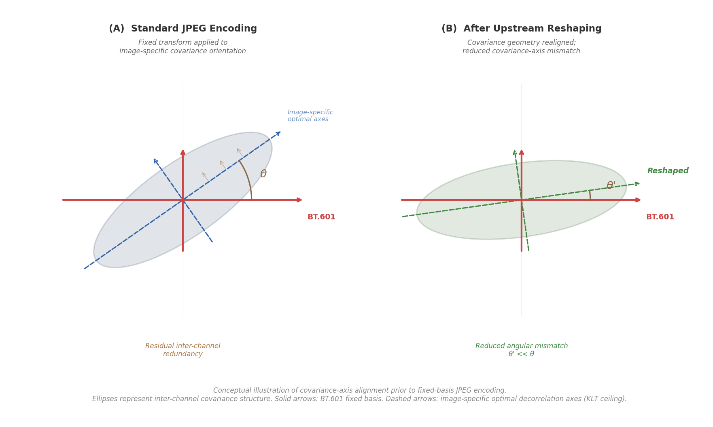
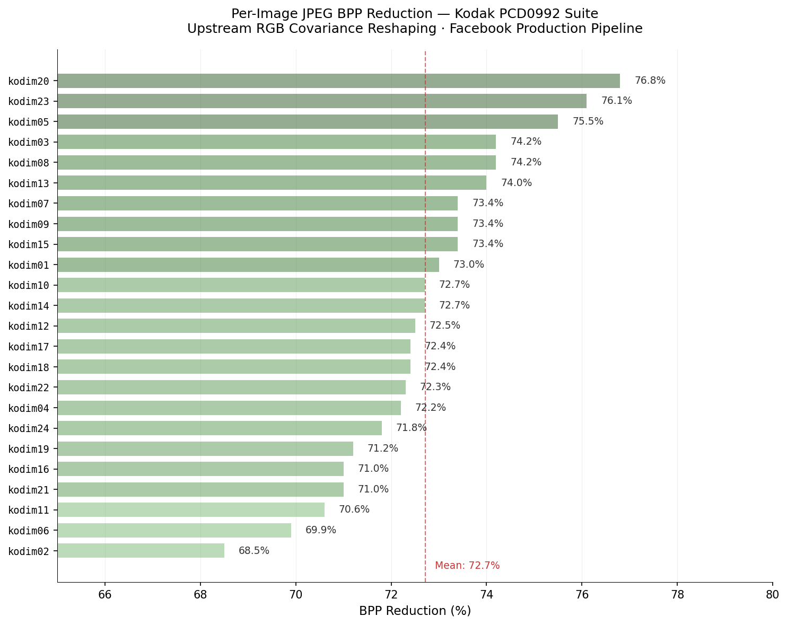

[README.md](https://github.com/user-attachments/files/27716531/README.md)
[](https://doi.org/10.5281/zenodo.20148091)

# SPDR Verification Suite — Kodak PCD0992

**Observed 72.7% mean JPEG BPP reduction across all 24 Kodak images via upstream RGB covariance reshaping. Independently reproducible. No codec modifications.**

---

## Abstract

This repository provides the reproducible verification framework for the Spatial Pixel Data Redistribution (SPDR) experimental series conducted on the Kodak Lossless True Color Image Suite (PCD0992). The suite documents an observed mean bits-per-pixel (BPP) reduction of 72.7% across all 24 images when upstream RGB covariance reshaping is applied prior to standard JPEG encoding through Facebook's production image pipeline. All downstream encoding operations — colorspace conversion, DCT, quantization, and entropy coding — remain unmodified. The repository includes the 24 original Kodak source images, 24 SPDR-processed source images, 48 Facebook pipeline outputs (two passes per image), 72 structured JSON measurement files, and deterministic verification scripts. Every reported measurement is independently reproducible from the provided materials using standard Python libraries.

Baetzel, J. (2026). Kodak PCD0992 Inter-Channel Redundancy Series.

---

## Research Status

This repository documents ongoing experimental research and reproducible observations. The reported findings have not undergone formal peer review. All measurements are deterministic and independently verifiable from the provided source materials, but should be interpreted as experimental results pending broader validation within the signal processing and image compression communities.

---

## Quick Verification

```bash
git clone https://github.com/PearsonZero/kodak-pcd0992-spdr-verification-suite
cd kodak-pcd0992-spdr-verification-suite
pip install -r requirements.txt
python3 scripts/verify_suite.py

```

The script measures every image in the repository and compares the results against the published JSON data. Total runtime: approximately 2 minutes. No configuration required.

To verify the Facebook pipeline results independently: upload any image from `images:clean:` to Facebook (as a photo post or message attachment), download the recompressed output, and run:

```bash
python3 scripts/batch_measure.py path/to/downloaded/image.jpg
```

Compare the output against the corresponding JSON in `data:json:fb1:` or `data:json:fb2:`.

---




---

## Scope & Limitations

This suite evaluates the statistical and compression-related behavior of upstream RGB covariance reshaping applied prior to standard JPEG encoding. The reported measurements reflect observations under the documented preprocessing conditions and the specific evaluation corpus described below.

### Architectural Boundaries

The observed BPP reductions are not produced through custom codecs, neural-network inference, or lowered JPEG quality settings, but through upstream covariance reshaping prior to standard encoding.

The images in this repository are standard JPEG files processed upstream of any colorspace conversion or compression pipeline. Every encoder and decoder in the delivery chain is unmodified. The BPP reduction occurs because the inter-channel covariance geometry of the pixel data has been reshaped before the encoder sees it.

- **No custom codecs.** The framework relies exclusively on standard, unmodified downstream JPEG encoding. No modifications are made to colorspace transforms, DCT implementation, quantization tables, or entropy coding stages.
- **No machine learning.** No neural networks, generative models, or learned priors are utilized. All transformations are deterministic and derived from covariance geometry.
- **No entropy tuning.** Results are achieved through upstream redistribution in the spatial/color domain, not through modifications to Huffman tables or arithmetic coding.
- **No quality reduction.** SPDR-processed images encode at lower BPP because inter-channel redundancy is reduced before encoding, not because visual information is discarded.

The theoretical basis for this effect is documented across four prior papers in this series (see [Research Series](#research-series) below). Standard JPEG converts RGB to YCbCr using the BT.601 transform — a fixed linear rotation designed as a one-size-fits-all decorrelation step. The Karhunen-Loève Transform (KLT) defines the optimal decorrelation for any given image, but it is image-specific and therefore impractical inside a fixed-format codec. The gap between BT.601's fixed axes and each image's KLT-optimal axes determines how much inter-channel redundancy passes through to the frequency domain untouched. SPDR reshapes the covariance geometry in RGB space to reduce this gap, allowing the existing fixed transform to capture more of the available redundancy without any modification to the transform itself.

Reported measurements should not be generalized beyond the evaluated dataset without further validation.

---

## Dataset Provenance

The evaluation corpus is derived exclusively from the Kodak Lossless True Color Image Suite (PCD0992), a widely referenced benchmark dataset in image compression research. The canonical source is:

> https://r0k.us/graphics/kodak/

The 24 images span a wide range of photographic content and inter-channel covariance geometries — from highly correlated (near one-dimensional) to strongly three-dimensional color distributions. Condition numbers range from 7.55 to 1,739.16 across the suite, covering more than two orders of magnitude.

No additional training datasets, external learned models, or supplementary image corpora are incorporated into the verification framework. SHA-256 checksums are provided for all source and processed assets to ensure bit-perfect replication of results.

---

## Research Series

This verification suite is the final component of a six-part experimental series investigating inter-channel redundancy structure in the Kodak suite and the compression implications of upstream covariance reshaping.

| # | Focus | Repository | DOI |
|---|-------|-----------|-----|
| 1 | Statistical Characterization | [kodak-pcd0992-statistical-characterization](https://github.com/PearsonZero/kodak-pcd0992-statistical-characterization) | [10.5281/zenodo.20148205](https://doi.org/10.5281/zenodo.20148205) |
| 2 | BT.601 Decorrelation Gap | [kodak-pcd0992-bt601-decorrelation-gap](https://github.com/PearsonZero/kodak-pcd0992-bt601-decorrelation-gap) | [10.5281/zenodo.20148225](https://doi.org/10.5281/zenodo.20148225) |
| 3 | Geometry of Misalignment | [kodak-pcd0992-geometry-of-misalignment](https://github.com/PearsonZero/kodak-pcd0992-geometry-of-misalignment) | [10.5281/zenodo.20148259](https://doi.org/10.5281/zenodo.20148259) |
| 3n | Orthogonal Constraint (Technical Note) | [kodak-pcd0992-orthogonal-constraint](https://github.com/PearsonZero/kodak-pcd0992-orthogonal-constraint) | [10.5281/zenodo.20148282](https://doi.org/10.5281/zenodo.20148282) |
| 4 | Directional Perturbation | [kodak-pcd0992-directional-perturbation-compression-response](https://github.com/PearsonZero/kodak-pcd0992-directional-perturbation-compression-response) | [10.5281/zenodo.20148312](https://doi.org/10.5281/zenodo.20148312) |
| 5 | **Verification Suite** | **this repository** | [10.5281/zenodo.20148091](https://doi.org/10.5281/zenodo.20148091) |

---

## Validated Environment

The following environment was used for all primary verification runs. While the scripts use standard Python libraries and should function across platforms, these are the conditions under which the reported measurements were generated and validated.

- **Runtime:** Python 3.9+
- **Dependencies:** NumPy (covariance and eigenvalue computation), Pillow (JPEG decode and pixel array access)
- **Operating System:** macOS (Darwin x86_64/arm64)
- **Shell:** Zsh
- **Filesystem:** UTF-8, deterministic file ordering

BPP is calculated as `(file_size_bytes × 8) / pixel_count` — integer-derived and platform-independent. Covariance matrices and eigenvalues are computed via NumPy from raw 8-bit RGB pixel arrays. No floating-point determinism constraints apply to the primary BPP measurements.

---

## Summary Statistics

| Metric | Value |
|--------|-------|
| Corpus Size | 24 images (Kodak PCD0992) |
| Mean BPP (SPDR Source) | 4.803 |
| Mean BPP (FB Pipeline Output) | 1.312 |
| Mean BPP Reduction | 72.7% |
| Reduction Range | 68.5% – 76.8% |
| Pipeline Passes | 2 (FB1 + FB2) |
| Verification Outputs | 72 JSON records (24 images × 3 conditions) |
| Hash Validation | SHA-256 (72/72 JSON-to-image alignment) |
| Mean Avg \|r\| (Source) | 0.8473 |
| Mean Avg \|r\| (FB Output) | 0.8482 |

### Comparative Baseline

The 72.7% mean reduction reported above represents the delta between high-bitrate SPDR source images and the Facebook pipeline outputs. Because the SPDR sources (2560×1707) and the Kodak originals (768×512) enter the pipeline at different resolutions, a controlled comparison is necessary to isolate the covariance reshaping effect from pipeline scaling behavior.

A controlled baseline documented in [Paper 4: Directional Perturbation](https://doi.org/10.5281/zenodo.20148312) passes both original and SPDR-processed images through the same Facebook pipeline and compares outputs at matched resolution:

| Condition | Mean BPP (FB Output) |
|-----------|---------------------|
| Kodak originals through FB pipeline | 2.591 |
| SPDR-processed through FB pipeline | 1.366 |
| **Controlled BPP reduction** | **54.5%** |

A control condition applying the identical pipeline — including resolution change and format conversion — without covariance perturbation produces no comparable BPP reduction, confirming that the observed efficiency gain is driven by upstream covariance reshaping rather than downstream pipeline artifacts.

---

## Per-Image Verification Results

The complete per-image verification outputs are included below to preserve transparency and permit independent inspection of aggregate behavior across the Kodak PCD0992 corpus. Summary statistics reported elsewhere in this document are derived directly from these deterministic measurements.

Machine-readable verification outputs are provided in `data:json:clean:`, `data:json:fb1:`, and `data:json:fb2:`. The table and figure below are human-readable summaries.



| Image | Source BPP | FB1 BPP | FB2 BPP | Reduction | Avg \|r\| |
|-------|-----------|---------|---------|-----------|-----------|
| kodim01 | 5.191 | 1.400 | 1.416 | 73.0% | 0.891 |
| kodim02 | 5.628 | 1.775 | 1.790 | 68.5% | 0.613 |
| kodim03 | 3.962 | 1.024 | 1.033 | 74.2% | 0.546 |
| kodim04 | 4.637 | 1.287 | 1.295 | 72.2% | 0.722 |
| kodim05 | 5.707 | 1.396 | 1.417 | 75.5% | 0.890 |
| kodim06 | 4.958 | 1.491 | 1.513 | 69.9% | 0.975 |
| kodim07 | 4.240 | 1.126 | 1.138 | 73.4% | 0.831 |
| kodim08 | 5.658 | 1.459 | 1.481 | 74.2% | 0.947 |
| kodim09 | 4.333 | 1.151 | 1.159 | 73.4% | 0.855 |
| kodim10 | 4.465 | 1.221 | 1.230 | 72.7% | 0.940 |
| kodim11 | 4.555 | 1.337 | 1.347 | 70.6% | 0.858 |
| kodim12 | 4.021 | 1.106 | 1.116 | 72.5% | 0.916 |
| kodim13 | 6.040 | 1.569 | 1.594 | 74.0% | 0.967 |
| kodim14 | 5.078 | 1.386 | 1.398 | 72.7% | 0.660 |
| kodim15 | 4.415 | 1.174 | 1.182 | 73.4% | 0.898 |
| kodim16 | 4.236 | 1.229 | 1.240 | 71.0% | 0.931 |
| kodim17 | 4.384 | 1.212 | 1.224 | 72.4% | 0.968 |
| kodim18 | 5.526 | 1.526 | 1.549 | 72.4% | 0.845 |
| kodim19 | 4.841 | 1.395 | 1.410 | 71.2% | 0.913 |
| kodim20 | 4.089 | 0.948 | 0.958 | 76.8% | 0.978 |
| kodim21 | 4.868 | 1.414 | 1.428 | 71.0% | 0.833 |
| kodim22 | 5.158 | 1.431 | 1.445 | 72.3% | 0.852 |
| kodim23 | 4.270 | 1.019 | 1.029 | 76.1% | 0.572 |
| kodim24 | 5.001 | 1.410 | 1.430 | 71.8% | 0.958 |

The suite spans the full spectrum of inter-channel correlation structure — from highly one-dimensional images (kodim20, Avg |r| = 0.978) to strongly three-dimensional images (kodim03, Avg |r| = 0.546). BPP reduction is consistent across all covariance geometries.

---

## Pipeline Stability

Each image was passed through Facebook's JPEG recompression pipeline twice (FB1 and FB2). The covariance geometry is stable through both passes — Avg |r| values match to the fourth decimal place between FB1 and FB2 across all 24 images. FB2 file sizes increase by an average of 1.5% relative to FB1, consistent with trivial re-encoding overhead.

The compression geometry established by upstream reshaping does not degrade through repeated lossy encoding.

---

## Measurement Schema

Each JSON file contains:

| Field | Description |
|-------|-------------|
| `source_file` | Filename |
| `format` | JPEG |
| `resolution` | Width × Height |
| `pixels` | Total pixel count |
| `file_size_bytes` | File size on disk |
| `bpp` | Bits per pixel (`file_size_bytes × 8 / pixels`) |
| `correlations` | Pairwise Pearson R-G, R-B, G-B and average absolute |
| `channel_stats` | Per-channel mean, std, min, max |
| `PC1_pct` / `PC2_pct` / `PC3_pct` | PCA variance explained |
| `eigenvalues` | Covariance eigenvalues |
| `condition_number` | λ₁ / λ₃ |
| `theta2` / `theta3` | BT.601 chrominance misalignment angles (degrees) |
| `loo_dev` | Leave-one-out deviation from θ₂–θ₃ regression |
| `spatial_autocorrelation_avg` | Mean lag-1 spatial autocorrelation |
| `sha256` | File hash for integrity verification |

---

## Repository Structure

| Directory | Contents | Role |
|-----------|----------|------|
| `images:originals:` | 24 unmodified Kodak PCD0992 PNGs (768×512) | Reference baseline |
| `images:clean:` | 24 SPDR-processed source images (2560×1707 JPEG) | Evaluation inputs |
| `images:fb1:` | 24 Facebook pipeline pass 1 outputs (2048×1366 JPEG) | Pipeline evidence |
| `images:fb2:` | 24 Facebook pipeline pass 2 outputs (2048×1366 JPEG) | Stability evidence |
| `data:json:clean:` | 24 source image measurement JSONs | Canonical metrics |
| `data:json:fb1:` | 24 FB1 output measurement JSONs | Canonical metrics |
| `data:json:fb2:` | 24 FB2 output measurement JSONs | Canonical metrics |
| `scripts/` | `verify_suite.py`, `batch_measure.py` | Verification tools |
| `figures/` | Per-image BPP reduction chart | Visual summary |
| `verify.sh` | Shell-based verification entry point | Quick verification |
| `LICENSE` | CC BY 4.0 license |
| `requirements.txt` | Python dependencies |
| `codecheck.yml` | CODECHECK manifest |

---

## Citation

If utilizing this verification suite or the SPDR methodology in your research, please cite:

> Baetzel, J. (2026). *SPDR Verification Suite: Independently Verifiable Compression Response Across the Kodak PCD0992 Suite.* Zenodo. DOI: [10.5281/zenodo.20148091](https://doi.org/10.5281/zenodo.20148091)

Source repository: [github.com/PearsonZero/kodak-pcd0992-spdr-verification-suite](https://github.com/PearsonZero/kodak-pcd0992-spdr-verification-suite)

---

## Archival References

| Platform | Record |
|----------|--------|
| Zenodo | [10.5281/zenodo.20148091](https://doi.org/10.5281/zenodo.20148091) |
| OpenAIRE | [Indexed record](https://explore.openaire.eu/search/result?pid=10.5281/zenodo.20148091) |
| GitHub | [PearsonZero/kodak-pcd0992-spdr-verification-suite](https://github.com/PearsonZero/kodak-pcd0992-spdr-verification-suite) |

---

## License

Creative Commons Attribution 4.0 International (CC BY 4.0)
